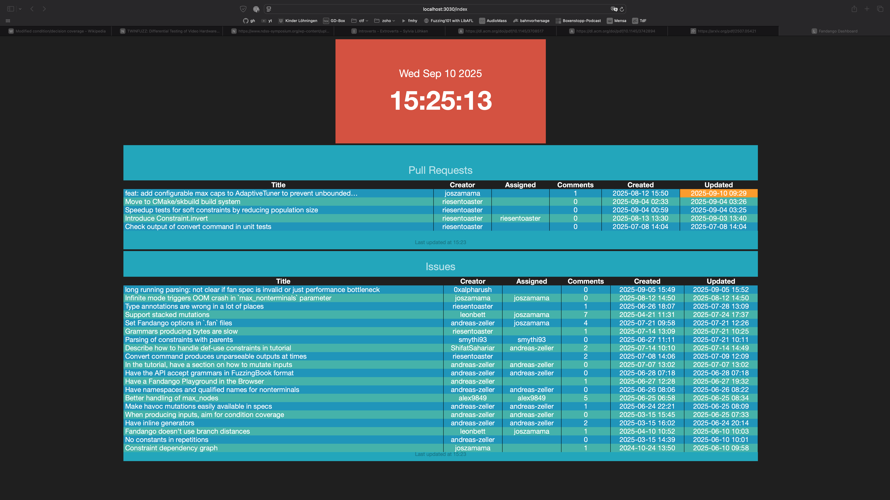

# Fandango Dashboard



A Smashing dashboard with GitHub Issues integration.

## Running with Docker

### Basic Usage
```bash
docker build -t fandango-dashboard .
docker run --rm -p 3030:3030 fandango-dashboard
```

## Access
Once running, access the dashboard at http://localhost:3030

Check out http://smashing.github.io/smashing for more information.
